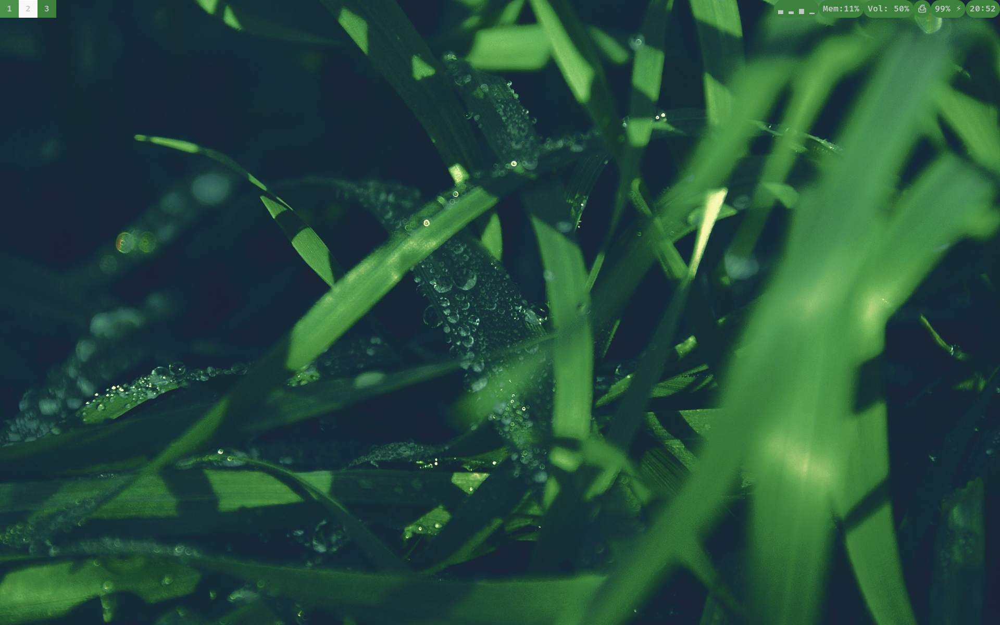

# Welcome to ClemTheAlien's NixOS Dotfiles for Desktop Usage 
I use home manager so make sure to ```home manager switch --flake .nixos_config``` ```sudo nixos-rebuild switch --flake .nixos_config```
in the .nixos_config directory to update the system :3. 




> **Use my read the additional.md then use the install script. Remeber to start the script on a fresh NixOS install then rebuild boot and switch**

## Flatpaks I Use 
- Flatseal
- Prism Launcher
- Sober
- Openshot
- Dino