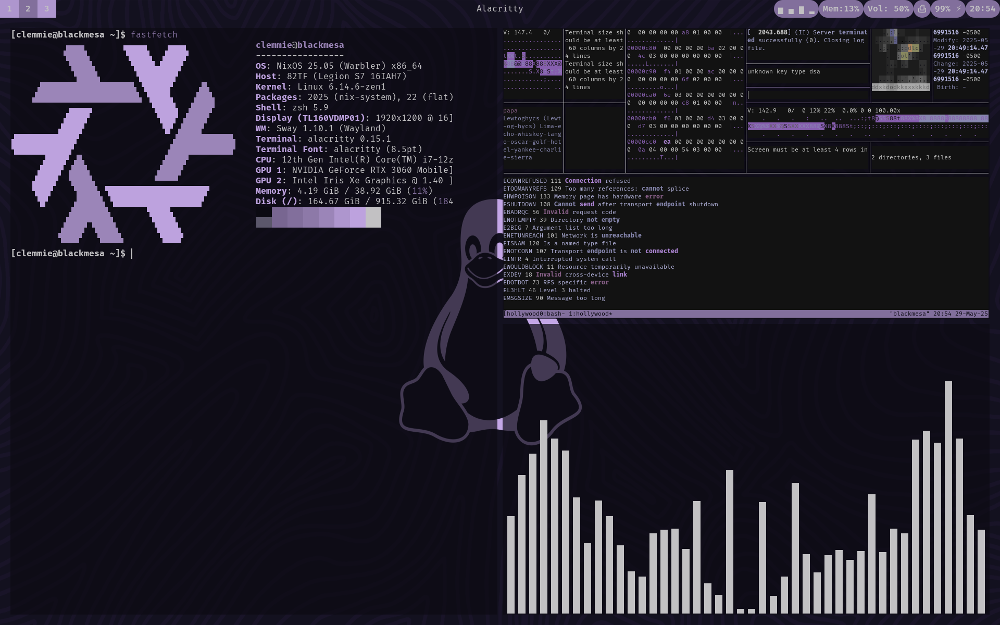

# Welcome to ClemTheAlien's NixOS Dotfiles for Desktop Usage!
These dotfiles require an exact or similar layout of my configuration.nix file in order to function. These dots should be applicable across most distros if you download the applications listed in my configuration.nix file while also copying the folders to the .config folder. Warning that these dots were made with NixOS in mind.

> **Look in `assets` folder for more screenshots
## Warnings
- I omitted my Timezone and Hostname in the config so make sure to edit that
- I have Unfree Packages enabled
- I am on the 25.05 version of NixOS (Warbler)
- I use ZSH instead of BASH and I use the autosuggestion and syntax higlighting plugins, in which I git clone to .zsh 

> **Follow the Instructions.md file to install my dotfiles until I learn Home Manager and Flakes well enough.**

## Flatpaks I Use 
- Steam
- Lutris
- Flatseal
- Spotify
- Prism Launcher
