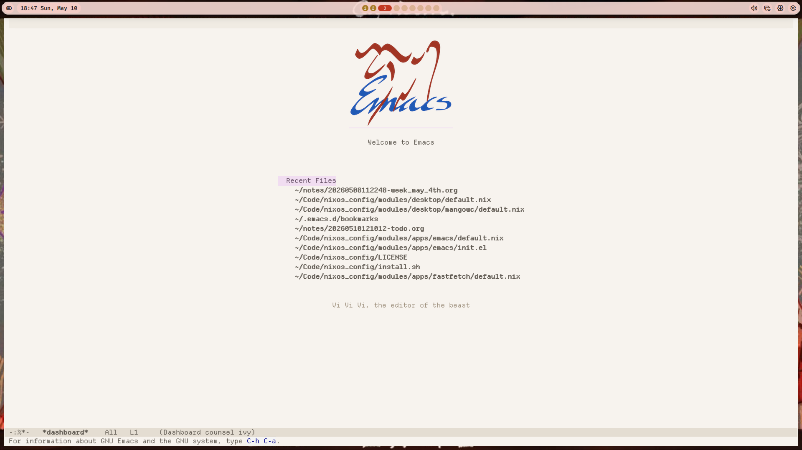
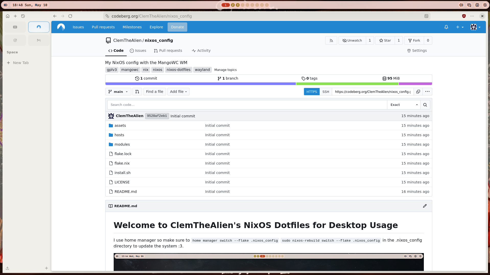

# Welcome to ClemTheAlien's NixOS Dotfiles 
Make sure to ```home manager switch --flake .nixos_config#[INSERT_HOST]``` ```sudo nixos-rebuild switch --flake .nixos_config[INSERT_HOST]``` or use the built in ```update```, ```home_update```, and or ```world_update``` to update your config :3. 





> **Remeber to start the script on a fresh NixOS install and rebuild both world and home at the same time for this to work**

## Flatpaks I Use 
- Flatseal
- Prism Launcher
- Openshot
- Zen Browser
