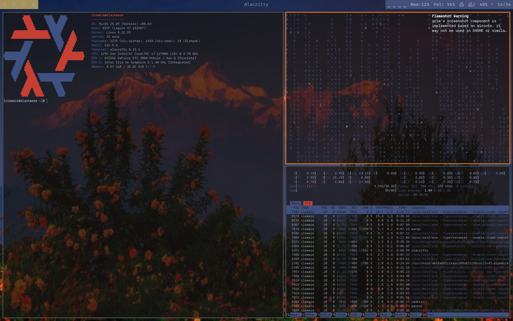
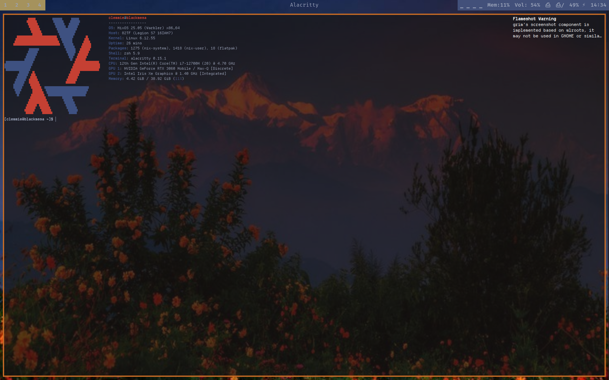

# Welcome to ClemTheAlien's NixOS Dotfiles for Desktop Usage!
These dotfiles require an exact or similar layout of my configuration.nix file in order to function. These dots should be applicable across most distros if you download the applications listed in my configuration.nix file while also copying the folders to the .config folder. Warning that these dots were made with NixOS in mind.

> **Use my read the additional.md then use the install script. Remeber to start the script on a fresh NixOS install then rebuild boot and switch**

## Flatpaks I Use 
- Steam
- Flatseal
- Spotify
- Prism Launcher
- Sober
- Openshot
- Dino